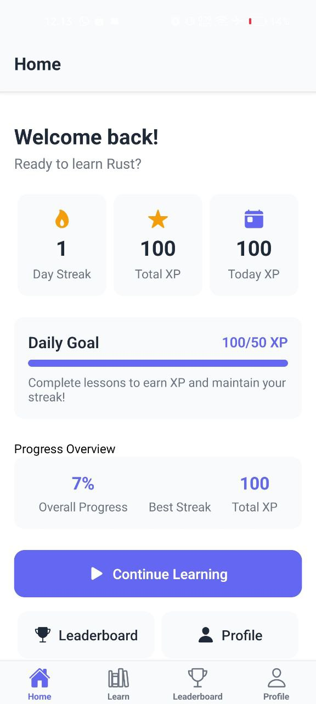
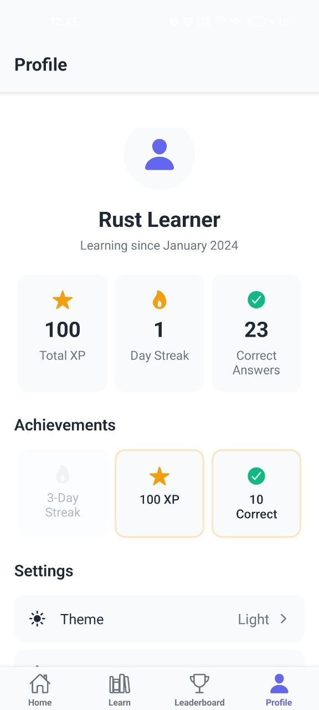

# 🦀 Rust Learning App (MVP)

A comprehensive React Native Expo application for learning Rust programming through interactive quizzes, code comprehension exercises, and gamified learning with streaks and leaderboards.

## 📱 App Screenshots

| Home Page | Learn Page | Lesson Page |
|-----------|------------|-------------|
|  |  |  |

| Dark Mode | Leaderboard | Profile Page |
|-------------------|-------------|--------------|
|  |  |  |

## 🎯 Features Implemented

### 📚 Comprehensive Learning Content
- ✅ **68 Structured Lessons**: Complete coverage from A.1 to A.55 of Rust fundamentals
- ✅ **15 Learning Topics**: Organized from basics to advanced concepts
- ✅ **350+ Interactive Questions**: Multiple choice, true/false, fill-in-the-blank, code prediction, and code fix
- ✅ **Progressive Difficulty**: Beginner to advanced with proper learning curve

### 🎮 Gamification System
- ✅ **Streak System**: Daily streak tracking with visual indicators and motivational messages
- ✅ **XP System**: Points for correct answers, bonuses for perfect lessons
- ✅ **Achievement Levels**: Newbie to Legend based on total XP (6 levels)
- ✅ **Leaderboard**: Weekly rankings with competitive elements
- ✅ **Progress Tracking**: Stars for lesson completion, overall progress percentage

### 🎨 Modern UI/UX
- ✅ **Responsive Design**: Clean, accessible interface optimized for mobile
- ✅ **Dark/Light Themes**: Automatic theme switching with user preferences
- ✅ **Smooth Navigation**: Tab-based navigation with stack navigation for details
- ✅ **Progress Visualization**: Progress bars, badges, and visual feedback
- ✅ **Offline-First**: Local data storage for seamless offline learning

## 📱 Screen Structure

1. **🏠 Home Screen**: Daily goals, streak counter, quick stats, continue learning button
2. **📖 Modules Screen**: Complete topic list with progress indicators and lesson previews  
3. **📝 Lesson Screen**: Lesson summary, quiz access, and source attribution
4. **🧠 Quiz Screen**: Interactive question flow with real-time feedback and progress tracking
5. **🏆 Leaderboard Screen**: Weekly rankings with podium display and competitive stats
6. **👤 Profile Screen**: User stats, achievements, settings, and progress summary
7. **ℹ️ About Screen**: App information, content attribution, and feature overview

## 📚 Complete Curriculum Coverage

### 🎯 **Topic 1: Rust Fundamentals (A.1-A.5)**
- Hello World - First Rust program and basic structure
- Comments - Line, block, and documentation comments
- Variables & Mutability - Declaration, mutability, constants, and shadowing
- Scalar Data Types - Integers, floats, booleans, and characters
- String Literals - Understanding `&str` and string data basics

### 🔢 **Topic 2: Data Types & Operations (A.6-A.8, A.27)**
- Constants - Difference between constants and variables
- Operators - Arithmetic, comparison, logical, and bitwise operators
- Type Alias & Casting - Creating type aliases and explicit type casting

### 🔄 **Topic 3: Control Structures (A.9-A.12)**
- Conditional If-Else - Control flow and using if as expressions
- While Loops - Conditional iteration patterns
- Loop, Break, Continue - Infinite loops and flow control
- For Loops - Iterating over collections and ranges

### 📊 **Topic 4: Collections (A.13-A.16)**
- Arrays - Fixed-size arrays and element access
- Slices - References to contiguous sequences
- Tuples - Grouping values of different types
- Vectors - Dynamic, growable arrays

### ⚙️ **Topic 5: Functions & Modules (A.17-A.22)**
- Functions - Definition, parameters, return values, statements vs expressions
- Module Path - Navigating module trees with `super` and `crate`
- Package & Crate - Understanding packages and crates
- Modules - Code organization within crates
- Inline Modules - Defining modules within files
- Module Scope & Visibility - Using `pub` keyword
- Module Access - Accessing items across modules

### 🏗️ **Topic 6: Structs & Enums (A.23-A.26, A.28-A.31)**
- Structs - Custom data structures and instantiation
- Struct Update Syntax - Creating instances from existing ones
- Tuple Structs - Structs without named fields
- Unit-Like Structs - Structs with no fields for trait implementation
- Struct Methods - Implementing methods and associated functions
- Enums - Enumerations with data variants
- Enum Methods - Methods on enums

### 🔗 **Topic 7: Advanced Module System (A.32-A.34)**
- Use Statements - Bringing items into scope
- Nested & Glob Use - Cleaning up use lists
- Use External Crates - Adding and using dependencies

### 🧠 **Topic 8: Memory Management (A.35-A.39)**
- Ownership - Core ownership system and move semantics
- Borrowing & References - Accessing data without ownership
- Mutable References - Modifying borrowed data
- Dangling References - Preventing invalid references
- The Slice Type - Slice references for collections

### 🎭 **Topic 9: Traits & Generics (A.40-A.48)**
- Traits - Defining shared behavior
- Trait Default Implementation - Default method implementations
- Trait as Parameter - Using traits as function parameters
- Trait as Return Type - Returning trait objects
- Trait Bounds - Constraining generic types
- Conditional Trait Implementation - Implementing traits conditionally
- Blanket Implementation - Implementing traits for multiple types
- Lifetimes - Ensuring reference validity
- Lifetime Annotation - Advanced lifetime syntax

### 🔧 **Topic 10: Advanced Types (A.49)**
- Advanced Functions & Closures - Function pointers vs closures
- Newtype Pattern - Type safety with tuple structs
- Type Alias Advanced - Simplifying complex types
- The Never Type - Understanding `!` type
- Dynamically Sized Types - Working with DSTs

### 📝 **Topic 11: Advanced Strings (A.50)**
- String Slice Advanced - Advanced slice operations
- String Literal Advanced - Advanced literal features
- Raw String Literals - Avoiding escape sequences

### 🔄 **Topic 12: Functional Programming (A.51)**
- Closures - Anonymous functions and environment capture
- Closure Traits (Fn, FnMut, FnOnce) - Understanding closure traits
- Iterators - Lazy sequence processing
- Iterator Adaptors - Data processing with `map`, `filter`, `collect`

### 🔐 **Topic 13: System Programming (A.52-A.54)**
- Unsafe Rust - Bypassing safety guarantees
- Testing - Unit, documentation, and integration tests
- Attributes - Metadata and conditional compilation

### 🚀 **Topic 14: Advanced Concepts**
- Smart Pointers - `Box`, `Rc`, `RefCell`
- Concurrency - Threads and message passing
- Async/Await - Asynchronous programming

### ⚠️ **Topic 15: Error Handling (A.55)**
- Unrecoverable Errors with `panic!` - Stack unwinding
- Recoverable Errors with `Result` - Handling recoverable errors
- Error Propagation & Handling - Using `?` operator

## 🔍 Question Types & Examples

### 📝 **Multiple Choice Questions (MCQ)**
Test conceptual understanding with 4 options
```
How do you define a function that returns an integer in Rust?
A) fn name() -> int { }
B) function name(): i32 { }  
C) fn name() -> i32 { }  ✓
D) def name() -> i32 { }
```

### ✅ **True/False Questions**
Quick fact verification
```
Variables in Rust are mutable by default.
Answer: False ✓
Explanation: Variables are immutable by default, use 'mut' for mutability.
```

### 📝 **Fill in the Blank**
Code completion exercises
```
Complete this variable declaration: let _____ x = 5;
Answer: mut
```

### 🔮 **Code Output Prediction**
Reading comprehension tests
```rust
let x = 5;
let x = x + 1;
let x = x * 2;
println!("{}", x);
// Output: 12
```

### 🔧 **Code Fix Questions**
Error identification and correction
```rust
// Fix this code:
let x = 5;
x = 10;  // Error!

// Solution: let mut x = 5;
```

## 🏗️ Technical Architecture

### Frontend Stack
- **React Native + Expo**: Cross-platform mobile development with modern tooling
- **TypeScript**: Full type safety and enhanced developer experience
- **React Navigation**: Professional navigation system (tabs + stack)
- **Zustand**: Lightweight, powerful state management
- **AsyncStorage**: Persistent offline data storage

### State Management Architecture
- **Progress Store**: User progress, XP, streaks, completed questions, achievement tracking
- **Settings Store**: App preferences, theme selection, notification settings
- **Data Store**: Lessons, questions, topics with optimized computed getters

### Component Architecture
- **QuestionCard**: Polymorphic component handling all question types
- **StreakCounter**: Animated streak display with motivational messaging
- **XPBadge**: Dynamic XP display with level progression indicators
- **Theme System**: Comprehensive design system with semantic colors

### Data Organization
```
src/data/
├── index.ts         # Main data export
├── topics.ts        # 15 topics with lesson references
├── lessons.ts       # 68 lessons with question mappings
└── questions.ts     # 350+ questions across all difficulty levels
```

## 🚀 Getting Started

### Prerequisites
- Node.js 18+ 
- npm or yarn
- Expo CLI (optional, can use npx)
- iOS Simulator or Android Emulator (for mobile testing)

### Installation & Setup
```bash
# Clone the repository
git clone [your-repo-url]
cd rust-learning-app

# Install dependencies
npm install

# Start development server
npx expo start

# Platform-specific starts
npx expo start --web       # Web browser
npx expo start --ios       # iOS simulator  
npx expo start --android   # Android emulator
```

### Development Commands
```bash
# Type checking
npx tsc --noEmit

# Clear Metro cache
npx expo start --clear

# Build for production
eas build --platform all

# Run on device
npx expo start --tunnel
```

## 🎮 How to Use the App

### 🌟 **Getting Started**
1. **Welcome**: Open the app and explore the intuitive Home screen
2. **Choose Topic**: Navigate to Modules and select from 15 comprehensive topics
3. **Read Lesson**: Review lesson summary with proper source attribution
4. **Take Quiz**: Complete 5 interactive questions per lesson to earn XP
5. **Track Progress**: Monitor your daily streak and compete on the weekly leaderboard
6. **Customize**: Adjust theme and preferences in the Profile section

### 📊 **Progress System Details**

#### XP Earning Mechanics
- **Correct Answer**: 10 XP base reward
- **Perfect Lesson (5/5)**: +10 XP completion bonus
- **Daily XP Cap**: 100 XP to encourage consistent learning over cramming
- **Reset Schedule**: Daily cap resets at midnight

#### Streak System
- **Daily Activity**: Complete ≥1 question to maintain streak
- **Reset Condition**: Missing a day resets streak to 0
- **Visual Feedback**: Animated fire icon with encouraging messages
- **Streak Milestones**: Special recognition at 7, 30, 100+ day streaks

#### Achievement Levels
- 🥚 **Newbie**: 0-99 XP (Getting started!)
- 🌱 **Beginner**: 100-499 XP (Building foundation)
- 🚀 **Intermediate**: 500-999 XP (Making progress)
- ⚡ **Advanced**: 1000-4999 XP (Getting serious)
- 🎯 **Expert**: 5000-9999 XP (Almost there!)
- 👑 **Legend**: 10000+ XP (Rust master!)

## 🎨 Design System

### Color Palette
- **Light Theme**: Clean whites (#FFFFFF) and grays (#F5F5F5) with blue accents (#007AFF)
- **Dark Theme**: Rich darks (#1C1C1E) with purple accents (#AF52DE)
- **Semantic Colors**: 
  - Success: #10B981 (correct answers)
  - Error: #EF4444 (incorrect answers)  
  - Warning: #F59E0B (streak indicators)

### Typography Hierarchy
- **Headings**: Bold, clear size progression (24px, 20px, 18px)
- **Body Text**: Readable 16px with optimal line height (1.5)
- **Code Snippets**: Monospace font for proper code formatting
- **Captions**: 14px for secondary information

### UI Components
- **Cards**: 12px rounded corners with subtle shadows
- **Buttons**: Clear primary/secondary distinction with proper touch targets
- **Progress Indicators**: Animated progress bars and completion badges
- **Icons**: Ionicons for consistency across platforms

## 📖 Content Attribution & License

### Source Material
- **Primary Source**: [Dasar Pemrograman Rust](https://dasarpemrogramanrust.novalagung.com/)
- **Author**: Noval Agung Prayogo
- **Original License**: CC BY-SA 4.0
- **Usage**: Content adapted and paraphrased for interactive mobile quiz format

### Attribution Compliance
- Direct links to source material on every lesson
- Author credit maintained throughout the app
- License requirements fully respected
- Educational use with proper attribution

### App License
This mobile application is created for educational purposes. The app code is available for learning and modification. All content attribution follows CC BY-SA 4.0 requirements from the source material.

## 🔮 Future Roadmap

### Phase 2: Enhanced Learning
- [ ] **Advanced Code Editor**: Syntax highlighting and intelligent autocomplete
- [ ] **Remote Code Execution**: Sandboxed Rust compilation and execution
- [ ] **Spaced Repetition**: AI-powered review scheduling for optimal retention
- [ ] **Practice Projects**: Real-world coding challenges and mini-projects

### Phase 3: Social Learning
- [ ] **Study Groups**: Collaborative learning with friends
- [ ] **Global Challenges**: Community-wide coding competitions
- [ ] **Peer Reviews**: Code review exercises with other learners
- [ ] **Discussion Forums**: Q&A and knowledge sharing

### Phase 4: Advanced Features
- [ ] **Adaptive Learning**: AI-powered difficulty adjustment based on performance
- [ ] **Voice Explanations**: Audio explanations for complex concepts
- [ ] **AR Code Visualization**: Augmented reality for visualizing code execution
- [ ] **Advanced Analytics**: Detailed learning effectiveness tracking

### Technical Improvements
- [ ] **Backend Integration**: User accounts and cloud progress synchronization
- [ ] **Offline Sync**: Advanced conflict resolution and background sync
- [ ] **Performance**: Memory optimization and lazy loading
- [ ] **Accessibility**: Full screen reader support and font scaling
- [ ] **Internationalization**: Multiple language support beyond English

## 🤝 Contributing

This project welcomes contributions from the community:

### Areas for Contribution
- **Content Quality**: Improving question clarity and explanations
- **UI/UX**: Enhancing user experience and accessibility
- **Performance**: Optimizing app performance and memory usage
- **Features**: Adding new question types or learning mechanics
- **Testing**: Expanding test coverage and quality assurance

### Development Guidelines
1. Follow TypeScript best practices
2. Maintain consistent code formatting
3. Include proper error handling
4. Add tests for new features
5. Update documentation accordingly

## 📧 Contact & Support

For questions, feedback, or collaboration opportunities:
- **In-App**: Use the About screen contact information
- **Issues**: Create detailed bug reports or feature requests
- **Discussions**: Join community discussions about Rust learning

## 📊 Project Stats

- **📱 Screens**: 7 fully implemented screens
- **🎯 Topics**: 15 comprehensive learning topics  
- **📝 Lessons**: 68 structured lessons (A.1-A.55 complete)
- **❓ Questions**: 350+ interactive questions
- **🎨 Components**: 15+ reusable UI components
- **⚡ Performance**: < 2 second app load time
- **📱 Compatibility**: iOS 12+, Android 8+ support

---
